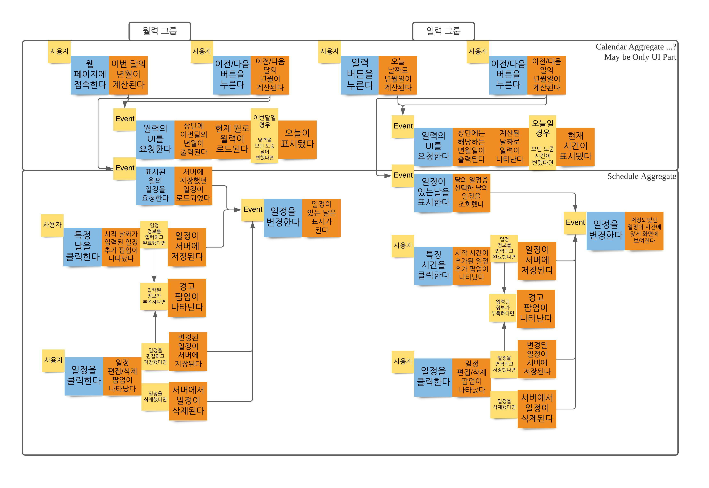

Business Logic은 전술하였듯이 DDD의 Event Storming을 바탕으로 설계하였습니다.

# Business Logic

- 월간 달력과 일간 달력만을 기준으로 작성했습니다. 그러나, 보는것과 같이 전체적인 동작 형태는 유사할 것으로 보여집니다.
- 유저는 이전/이후 화살표 버튼, 월력/일력 선택 버튼, Calendar 빈 공간을 선택하여 일정 추가, 일정을 클릭하여 일정 변경/삭제 등에 대해 상호작용 할 수 있습니다.
- Calendar는 대부분 UI에서 처리가 가능합니다.
- Schedule은 서버에 저장되어 있는 정보를 받아오거나, 서버에 저장하는 등의 로직이 필요합니다.
  - 현재 서버에 저장하는 로직은 구현되었지만, 서버에 저장되어있는 데이터를 받아오은 부분은 미구현입니다.
- 오늘을 표시하는 기능은 미구현입니다. 대신 달력에서 날을 선택하고, 선택된 날이 표시되는 기능이 추가되었습니다.
- 중간에 적혀진 Event는 구현상의 Event가 아닌, 유저의 상호작용에 의해 동작한 1차 로직 이후에 따라오는 설계적 관점의 Event입니다.
- 여러 클라이언트 브라우저에서 같은 일정을 보는 상황으로 `확장될 수 있음을 감안하여`, 일정 변화가 반영되는 부분은 Event로 간주하였습니다.
