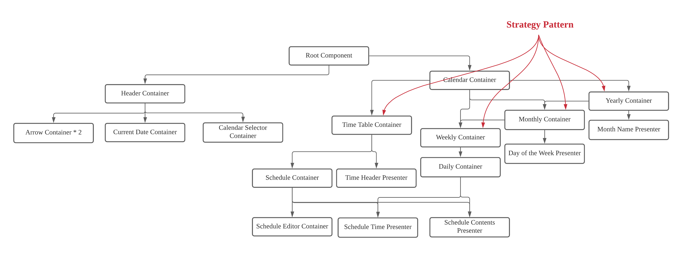

UI는 전술하였듯이 리액트에서 자주 쓰이는 설계 패턴인 Container-Presentational Pattern을 이용하여 설계했습니다.

# UI Components

- UI는 크게 Header와 Scheduler 컴포넌트로 나눠집니다.
- Scheduler 컴포넌트는 따로 표현은 안되어 있지만, 연간 달력, 월간 달력, 주간 달력, 일간 달력 등을 Strategy Pattern으로 감싼 컴포넌트입니다.
  - 이를 통해 사용자가 선택한 단위의 달력 구현체로 교체되는 구조로 설계했습니다.
- Current Day는 현재 동작이 없음에도 Container(UI 동작 부분)으로 구성되어있는데, 차후 현재 날짜를 클릭하여 특정한 년월일로 바로 이동할 수 있도록 확장될 것을 감안한 부분입니다.
  - 이 부분은 불필요한 boilerplate 코드 감소를 위해 실제 구현에서는 Container가 없을 수 있습니다.
